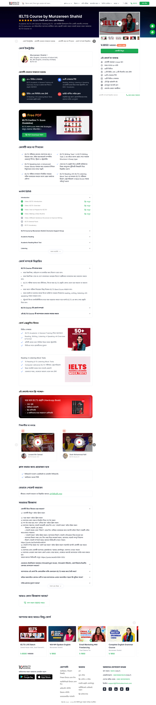

# 🚀 10 Minute School - Frontend Engineer Task

[](LICENSE)
[](CONTRIBUTING.md)

---

# 📌 Overview

This project is a frontend application built with Next.js and TypeScript,
created as a task for the Frontend Engineer (Level 1) position at 10 Minute
School. The application is a clone of the 10 Minute School website, focusing on:

- 🎯 Pixel-perfect UI implementation
- 🧱 Component-based architecture

---

## 🌍 Live URL

- [🔗 Vercel Deployment](https://think-greenly-one.vercel.app)

---

## 📂 Repository Link

- [🔗 GitHub Repo](https://github.com/khaledssbd/10MSchoolTask)

---

## 🛠️ Technologies Used

- ⚙️ **Framework:** [Next.js](https://nextjs.org/) (v15)
- 🧑‍💻 **Language:** [TypeScript](https://www.typescriptlang.org/)
- 🎨 **Styling:** [Tailwind CSS](https://tailwindcss.com/) (v4)
- 🧩 **UI Components:** [Shadcn UI](https://ui.shadcn.com/)
- 🖼️ **Icons:** [Lucide React](https://lucide.dev/)
- ✅ **Linting:** [ESLint](https://eslint.org/)
- 📦 **Package Manager:** [npm](https://www.npmjs.com/)

---

## ⚙️ Getting Started

To get a local copy up and running, follow these simple steps.

### ✅ Prerequisites

- 🧰 Node.js (v20 or higher)
- 📦 npm (v10 or higher)

### 🔧 Installation

1. Clone the repository:
   ```sh
   git clone https://github.com/khaledssbd/10MSchoolTask.git
   ```
2. Navigate to the project directory:
   ```sh
   cd 10MSchoolTask
   ```
3. Install the dependencies:
   ```sh
   npm install
   ```
4. Create a `.env` file by copying the `.env.example` file:
   ```sh
   cp .env.example .env
   ```
5. Add the necessary environment variables to the `.env` file. The following
   variables are required:
   ```
   NEXT_PUBLIC_BASE_API="https://api.10minuteschool.com/discovery-service/api/v1"
   ```

### 🚀 Running the Application

To run the application in development mode, use the following command:

```sh
npm run dev
```

➡️ Visit `http://localhost:3000` in your browser.

## 🧱 Folder Structure

```
. (root)
├── .next/           # Next.js build output
├── node_modules/    # Project dependencies
├── public/          # Static assets
│   └── 10mslogo-svg.svg
├── src/
│   ├── app/         # Next.js App Router
│   │   ├── (home)/  # Home page route group
│   │   ├── product/ # Product page route group
│   │   └── ...      # Other routes and layout files
│   ├── assets/      # Images and other static assets
│   ├── components/  # Reusable UI components
│   │   ├── Products/ # Components specific to product pages
│   │   ├── shared/  # Shared components (Navbar, Footer)
│   │   └── ui/      # Generic UI components (Button, Carousel)
│   ├── lib/         # Utility functions
│   ├── services/    # API service calls
│   └── types/       # TypeScript type definitions
├── .gitignore       # Git ignore file
├── next.config.ts   # Next.js configuration
├── package.json     # Project dependencies and scripts
├── README.md        # This file
└── tsconfig.json    # TypeScript configuration
```

## ✨ Key Features

- 🖼️ **Pixel-Perfect UI:** The UI is designed to be a pixel-perfect clone of the
  provided screenshots.
- ♻️ **Component-Based Architecture:** The application is built using a modular
  and reusable component structure.
- 📱 **Responsive Design:** The layout is responsive and adapts to different
  screen sizes.
- 🧠 **Type Safety:** The codebase is written in TypeScript for improved type
  safety and developer experience.

## 📜 Available Scripts

- `npm run dev`: Runs the application in development mode.
- `npm run build`: Builds the application for production.
- `npm run start`: Starts the production server.
- `npm run lint`: Lints the codebase for errors and style issues.

## 🤝 Contributing

Contributions are what make the open source community such an amazing place to
learn, inspire, and create. Any contributions you make are **greatly
appreciated**.

1. 🍴 Fork the Project
2. 🌿 Create your Feature Branch (`git checkout -b feature/AmazingFeature`)
3. 💾 Commit your Changes (`git commit -m 'Add some AmazingFeature'`)
4. 🚀 Push to the Branch (`git push origin feature/AmazingFeature`)
5. 🔁 Open a Pull Request


